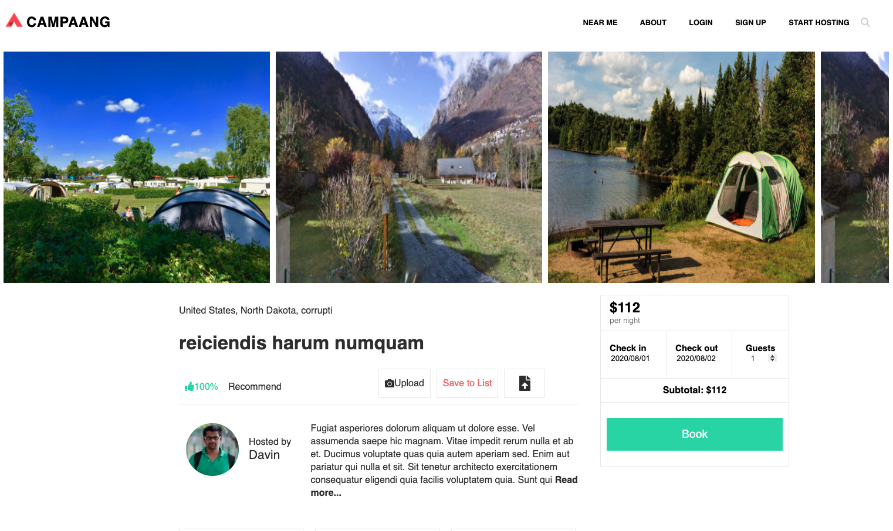

# bookingservice
Booking module for making reservation

## initial setup
Run these commands in order
1. npm install
2. npm run mysql
3. npm run db:setup

## launching
Run these commands in order
1. npm run build
2. npm run start

## demo
### CampAang Main Screenshot

### Booking Module

## full project reference

[CampAang](https://github.com/hrr46-fec-aang): Web application for campsite browsing and booking
